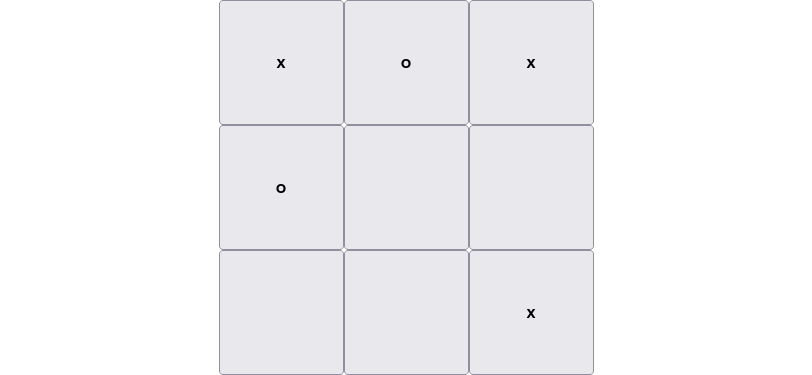

# About the program

The project is an implementation of a Tic-Tac-Toe game, made with the help of React and TypeScript. It was bootstrapped with [Create React App](https://github.com/facebook/create-react-app) (via NPM). The app features a responsive layout. Victory conditions are checked.

## Available scripts

In the project directory, you can run:

### `npm install`

Downloads dependencies required for the project. They're stored in `node_modules` folder.

### `npm start`

Runs the app in the development mode.
Open [http://localhost:3000](http://localhost:3000) to view it in the browser.

The page will reload if you make edits.
You will also see any lint errors in the console.

### `npm test`

Launches the test runner in the interactive watch mode. The project includes one test suite for the `VictoryChecker` class.

### `npm run build`

Builds the app for production to the `build` folder. It bundles React in production mode and optimizes the build for the best performance.